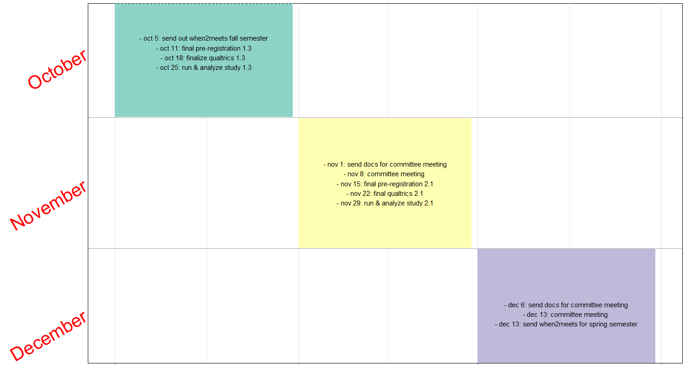

# Meeting goals

discuss plans for study 1.3 & general timeline/structure of dissertation, aligning on expectations 


```{r setup, include=FALSE}
options(htmltools.dir.version = FALSE)
knitr::opts_chunk$set(echo = FALSE, message=FALSE, warning = F)
options(scipen = 0, digits = 3, tibble.print_max = 50) 


if(!require('pacman')) {
  install.packages('pacman')
  }
pacman::p_load(tidyverse, here,plotly, devtools, jtools, papaja, DiagrammeR, vistime)

# devtools::install_github("gadenbuie/xaringanExtra")

xaringanExtra::use_xaringan_extra(include = c("panelset"))
```


???

Hi everyone, so today we'll be chatting about steps to move forward with my dissertation. i'm in my last year - the final stretch! so graduating by next may is my goal. Last time we met, you all approved of my dissertation proposal, with the caveat that would check in before I ran the final studies in my dissertation. So today we'll talk about the second to last study in my dissertation so I can run it before we meet again. Then, with whatever time we have left, I'll talk about my timeline for the dissertation & align on expectations so I can plan to finish by spring of next year! 

Anything else you all think is worth focusing on in this meeting? 


---

# Gap in knowledge


???
I'll quickly remind of the gap in the knowledge that my thesis aims to address before getting into the studies. Previous research suggests that women compete less than men, even when there are no gender differences in performance (see Niederle & Vesterlund, 2011 for review). Women’s reluctance to compete may contribute to persistent gender differences in labor market outcomes (Berge, Bjorvatn, Garcia Pires, & Tungodden, 2015; Buser, Niederle, & Oosterbeek, 2014; Reuben, Sapienza, & Zingales, 2015; Zhang, 2012), such as the gender wage gap, with men earning more than women, on average (Blau & Kahn, 2017). One mechanism for gender differences in competitiveness is confidence, which leads women to undercompete and men to overcompete (relative to their performance level) (Niederle & Vesterlund, 2007; van Veldhuizen, 2017).  Based on previous evidence of the benefits of enactive mastery through preparation and training on confidence (Bandura, Adams, & Beyer, 1977; Gist & Mitchell, 1992; Lent, Brown, Gover, & Nijjer, 1996; Schunk, 1981, 1982; Usher & Pajares, 2008), providing women with an adequate opportunity to prepare before a task may alleviate the gender gap in the choice to compete. Surprisingly, little work has explored how preparation differentially impacts men and women’s willingness to compete. 

---

# Chapter 1 

## Study 1 = Knowledge of prep
## Study 2 = Limited prep
## Study 3 = Unlimited prep

```{r}
# 

```

???
This is where Chapter 1 of my dissertation comes in. I attempt to fill this gap in the knowledge base by exploring the effect of the opportunity to prepare (conceptualized in 3 different ways) on the gender gap in competitiveness. Since I am giving participants opportunities to prepare in these studies, I also explore whether women may spend more time using the available opportunity to prepare in general than men in this chapter. I've already run two studies out of the 3 I propose for this chapter of the dissertation


---

# Chapter 1: RQ and hypotheses

- Does the opportunity to prepare affect gender differences in competitiveness?


???
The main RQs I'll be addressing in Chapter 1 through 3 experiments is: Does the opportunity to prepare (either in the form of knowledge of the opportunity, limited preparation, or unlimited preparation) affect gender differences in competitiveness? (click)

- I originally expected in studies 1 and 2 that, yes, women would be especially likely to compete in the condition when they had the opportunity to prepare before making the decision to compete. However, as I showed last time, I do not have evidence for this hypothesis, so in the third study (click), I don't have strong a priori hypotheses. i'm struggling with whether it makes sense to explicitly say that it's my hypothesis that there aren't any differences based on my previous studies OR we're using this as a way to test whether our manipulations were strong enough/it really depends on how the practice is structured that has an effect... or other way of framing this? (click) 


Are there gender differences in willingness to prepare? (click)

- Throughout these studies, I am hypothesizing that women will be more likely to use the opportunity to prepare than men in general. 


--

  - Studies 1 and 2: Yes.
    
--

  - Study 3: Maybe?

--

- Are there gender differences in willingness to prepare?

--
    - Studies 1-3: Yes. 


---


# Study 1.3 Methods

.pull-left[

- Conditions: Unlimited preparation on multiplication OR unlimited control task 
- N = 1100 on MTurk 
- 10 cents (piece rate) or 20 cents (tournament) per problem solved correctly
- Other vars included: risk tolerance, confidence, perceptions of gender differences

]


.pull-right[
```{r}

## code edited from here: https://datascienceplus.com/how-to-build-a-simple-flowchart-with-r-diagrammer-package/

grViz("digraph flowchart {
      # node definitions with substituted label text
      graph [fontname = Helvetica, overlap = true, fontsize = 10, nodesep = .1, penwidth = 2.0]

      node [shape = rectangle]        
      tab1 [label = '@@1']
      tab2 [label = '@@2']
      tab3 [label = '@@3']
      tab4 [label = '@@4']
      tab5 [label = '@@5']
      tab6 [label = '@@6']

      # edge definitions with the node IDs
      tab1 -> tab3;
      tab1 -> tab2;
      tab2 -> tab4;
      tab3 -> tab4;
      tab4 -> tab5;
      tab5 -> tab6 }

      [1]: 'MTurk'
      [2]: 'Practice'
      [3]: 'Control'
      [4]: 'Choice to compete'
      [5]: 'Optional practice?'
      [6]: 'Paid task' 
      ")

```
]
???
Study 3 (which I'm planning on running over the next month) seeks to replicate the null effect of preparation on the gender gap in competitiveness and test whether the gender difference in willingness to prepare holds using a third & final manipulation: unlimited preparation. In Study 3, participants will be randomly assigned to either a condition where they will be told they can prepare as long as they want (unlimited preparation) or complete as many rounds of a counting task as they want (control) before they decide whether to compete  

I plan to recruit 1100 participants on Mturk and they are told in advance that they will complete a series of paid multiplication problems.

Half of the participants have the opportunity to prepare for an unlimited amt of time, with the option to opt out whenever they want while they make this choice, and will have unlimited time to complete a task that is not relevant to the main task. 

Then, they decide whether their performance on the upcoming multiplication task will follow either a competitive tournament or noncompetitive piece rate payment scheme. This is how competitiveness is typically operationalized in this literature - a measure that has been shown to map onto competitive behavior outside of the lab (EG etc.). 

This is how the question is usually presented: Imagine you are paid to complete a task where you can choose between 2 different payment schemes for your performance: 1 per question correct or $2 per question correct, but only if you beat someone else that is also completing the task. Which option do you think you would prefer? The more competitive one where you are paid double the amount but must win in a tournament or the non-competitive one where you are paid for your performance completed regardless of how other people do? 

In our case, we offer participants $.10 per correct under the piece rate payment scheme, and $.20 per correct for the tournament payment scheme. 

After they make this decision, we give participants in the unlimited prep cond the option to practice before they complete the paid multiplication task. If they choose to prepare, participants will be asked to solve problems from the 1-12 times table. Otherwise, they will be asked if they want to solve problems on a counting task that is unrelated to the main task.  

Following the preparation portion of the study, participants will move on to the paid portion
of the study. They will be asked to solve as many problems as possible in two minutes and then they answered some follow up questions, including confidence - incentivized ($.10) to guess their relative performance compared to all other participants that completed the task by indicating the decile of their score relative to other participants; Risk tolerance - How do you see yourself: Are you generally a person who is fully prepared to take risks or do you try to avoid taking risks? (0-10); incentivized to answer their expectations of gender differences in performance (“Do you think men or women in this study correctly solved more multiplication problems on average?”), willingness to prepare (“Do you think men or women in this study spent more time practicing/studying before completing the multiplication task?”), and willingness to compete (“Do you think men or women in this study chose the tournament payment option more often?”). we'll also ask about perceptions of general gender differences in willingness to prepare: “For most tasks, do you think men or women generally prepare (i.e., practice and/or study) more?” of course we can't incentivized this because we can't directly test its overall accuracy. 


Some of the main questions I have for you all:
What are the characteristics of a control task that you think would be important to consider? should it not involve numbers so there is no chance that it helps performance? or as long as it's not the same task, you don't think it will be a big concern? for instance, coren has used a matrix task - where ppts are asked to count the number of 0s in a matrix of 0s and 1s - which I would argue is more of a perceptual task than math-dependent task. Another option is using addition problems instead of multiplication problems. 
should I be adding an optional practice after main DV of interest?
other variables I should be including? 


---


# Study 1.3 Analyses

- [pre-registration](https://docs.google.com/document/d/1MbKbAqRvsseDUTX_9AoXxGDjyhTkY9kOp0SFDaCTpkk/edit)


???
I'm going to go to the pre-reg for this study to show you what we have in mind for the analyses. 
my main questions are:
what do you think are other tests worth adding? 


---


# Timeline: Fall 2021

- oct 1: discuss plans for study 1.3 & general timeline/structure of dissertation, aligning on expectations
- nov 8: discuss results from study 1.3, tentative outline for ch 1, & feedback on plans for study 2.1
- dec 13: discuss results from study 2.1 & outline of full dissertation

```{r, fig.width=10, fig.height=5, dpi = 80, eval = F}

timeline_data <- data.frame(event = c(
"oct 1: discuss plans for study 1.3 
& general timeline/structure of dissertation, aligning on expectations", 
"nov 8: discuss results from study 1.3, 
tentative outline for ch 1, 
& feedback on plans for study 2.1",
"dec 13: discuss results from study 2.1 & outline of full dissertation"), 
                            start = c("2021-10-01", "2021-11-01","2021-12-01"), end = c("2021-10-31", "2021-11-30", "2021-12-31"), 
                            group = c("October","November", "December"))

p <- gg_vistime(timeline_data, linewidth = 100) + theme(
  plot.title = element_text(hjust = 0, size=30),
  text = element_text(size = 30),
  axis.text.x = element_blank(),
  axis.text.y = element_text(size = 30, color = "red", angle = 30),
  panel.border = element_rect(linetype = "dashed", fill=NA),
  panel.background = element_rect(fill = 'white'))


vistime(timeline_data, linewidth = 200, optimize_y = F)
# plotly_build(p)

# 

```


???
- next I'll go through my tentative timeline for finishing up on time. very open to feedback on what has worked/hasn't worked with your previous students here. 
- some ideas for my dissertation planning are based on livefreeordichotomize post - happy to share it out afterwards, highly recommend it for any students you are advising! 
- was thinking it would be great to meet semi-regularly so we are all on the same page & there aren't any surprises when it comes to final product. I plan on sending docs for committee meeting at least 1 week in advance, gives committee at least 1 week to read through the docs. then during the meeting, I can take notes on what we agreed upon & send out as a doc afterwards - would you all be interested in me sharing meeting notes docs afterwards? or just sharing an agenda/summary of what we'll talk about before each meeting? 
- so starting with this semester, here is what I have in mind for committee meeting scheduling (walk through timeline here THEN ask): 
	- broadly, my main goal this semester is to finalize all studies BEFORE I start writing, largely since it's hard to know what to write about if I don't know the results - but curious to see if you think I should focus on the dissertation one chapter at a time. 
---


# Timeline: Spring 2022

- jan 24: discuss ch 1 draft
- february 21: discuss ch 2 draft
- march 28: discuss full draft
- april 25: defend dissertation (PENN DEADLINE)
- may 1: make revisions to dissertation based on defense feedback
- may 2: deposit dissertation (PENN DEADLINE)


```{r,  out.width = '200px', eval = F}

timeline_data <- data.frame(event = c(
"jan 24: discuss ch 1 draft",
"february 21: discuss ch 2 draft",
"march 28: discuss full draft",
"april 25: defend dissertation (PENN DEADLINE)",
"- may 1: make revisions to dissertation based on defense feedback
- may 2: deposit dissertation (PENN DEADLINE)"),
                            start = c("2022-01-01", "2022-01-02","2022-03-01", "2022-04-01", "2022-05-01"), end = c("2022-01-31", "2021-11-30", "2021-12-31"),
                            group = c("January","February", "March", "April", "May"))

# p <- gg_vistime(timeline_data, linewidth = 100) + theme(
#   plot.title = element_text(hjust = 0, size=30),
#   axis.text.x = element_blank(),
#   axis.text.y = element_text(size = 30, color = "red", angle = 30),
#   panel.border = element_rect(linetype = "dashed", fill=NA),
#   panel.background = element_rect(fill = 'white'))
# p

```


???


---

# Other questions

- Final defense presentation
- Tentative structure
- Typical holdups 
- Virtual defense


???
- how far in advance should final version of dissertation be sent before defense? 1 or 2 weeks?
- what do we want the presentation to look like? 
	- timing 
	- presumably structure will follow structure of paper
	- I will present my research for the first 45 minutes, and then there will be a 15 minute public questions portion. You are advised (by me) not to ask questions unless pre-approved (again, by me). At the 1 hour mark, I will be moved into a private "room" for the defense portion where my committee will grill me for up to 45 minutes

- introduction
	- with broad lit review to tie together chapters & overview of studies 
- ch 1: studies 1-3
	- shorter lit review, methods & results, short discussion
- ch 2: study 1
	- shorter lit review, methods & results, short discussion
- conclusions
	- broad discussion of implications
- appendices
	- ch 1 - extra figures, analyses
	- ch 2
- references (across all studies?) 
- what are some of the more common pitfalls you see with dissertation defenses?
- what about writing? where do you usually feel like revisions are needed? What are some steps I can take to reduce to number of revisions needed for the final submission (on top of regular updates & checkins) 
- What have you seen as the biggest barriers to students finishing on time? 
- comfortable with a virtual defense? 

---

class: center, middle

# Thanks!

Slides created via the R package [**xaringan**](https://github.com/yihui/xaringan).

???
Thanks for the feedback today! looking forward to chatting soon 


---

# Results: Condition and gender -> Competition 


???
First, one of my pre-registered hypotheses was that women would be especially likely to compete when they have the opportunity to prepare. (CLICK)

Summary for panel 1:
This first panel shows the effect of gender and condition the proportion of participants who choose to compete in Study 1 - which is where I manipulated whether participants knew in advance that they would be able to prepare before they decided to compete or not. 

Contrary to our predictions, we do not find evidence of a
significant interaction between gender and condition on the decision to compete, 𝑏 = 0.06, 95%
CI [−0.63, 0.76], 𝑧 = 0.18, 𝑝 = .861 (see Figure 1), suggesting that women in the knowledge of
preparation condition were not uniquely more inclined to compete.

Summary for panel 2: 

In this second panel, I'm only showing the effect of condition among women (so you'll note that the sample size represented in this graph is smaller because I'm only using about half of the sample in this plot). We pre-registered a slightly different analysis in this study (e.g., a two-proportions z-test among women with condition & choice to compete as the main vars of interest instead of a logistic regression with an interaction between gender and condition on the choice to compete) - based on the idea that our hypothesis is primarily focused on the effect of condition on women. Either way, the results are essentially the same, -- we do not find evidence that the preparation condition (in this havingt he opportunity to complete a set number of problems before choosing to compete) increased women's willingness to compete. If anything, the effect was in the opposite of the expected direction. 

--

.panelset[
.panel[.panel-name[Study 1: Knowledge of preparation]
.left-column[

```{r}
clean1 <- read_csv("libs/data/Study1_clean.csv")

## recoding to factors for vars used in logits

clean1$gender <- factor(clean1$gender)
clean1$comp_choice <- factor(clean1$comp_choice)
clean1$condition <- factor(clean1$condition)
clean1$pract_choice <- factor(clean1$pract_choice)
```


N = `r nrow(clean1 %>% drop_na(condition))`


Condition did not reduce gender gap in choice to compete (*b* = `r tidy(glm(comp_choice ~ condition*gender,family=binomial,data = clean1)) %>% filter(term == "conditionpract:genderWoman")%>% select(estimate)`, *p* = `r tidy(glm(comp_choice ~ condition*gender,family=binomial,data = clean1)) %>% filter(term == "conditionpract:genderWoman")%>% select(p.value)`)

]

.right-column[
```{r, fig.width=8, fig.height=5, dpi=75}

# primary hypothesis 1 ----------------------------------------------------

dat <- dplyr::select(clean1,gender,comp_choice, condition) %>%
  dplyr::count(gender, comp_choice, condition) %>% filter(gender == "Woman", comp_choice == "tournament") %>% mutate(percent = n / sum(n),
                                                                                         error = sqrt((percent * (1-percent))/n))
dat1 <- dplyr::select(clean1,gender,comp_choice, condition) %>%
  dplyr::count(gender, comp_choice, condition) %>% filter(gender == "Man", comp_choice == "tournament") %>% mutate(percent = n / sum(n),
                                                                                       error = sqrt((percent * (1-percent))/n))


dat <- rbind(dat1, dat)

p <- ggplot(data = dat, aes(x = condition, fill = gender)) +
  geom_bar(aes(y = percent*100),
  position = "dodge", stat = "identity") + geom_errorbar(aes(ymin =(percent*100)-(error*100), ymax =(percent*100)+(error*100)), width=.05,
  position=position_dodge(.9)) + 
  labs(x = 'Condition', y = 'Percentage Competing') +
  scale_fill_manual(values=c("springgreen3", "slateblue1")) + theme_apa() +
  scale_x_discrete(labels = c("Control", "Prepare")) + theme(panel.border  = element_blank()) +
  #draws x and y axis line
  theme(axis.line = element_line(color = 'black'))
fig <- ggplotly(p)

fig <- plotly_build(fig)

fig$x$data[[1]]$name <- "Men"
fig$x$data[[2]]$name <- "Women"


fig

```
]

]


.panel[.panel-name[Study 2: Limited preparation]
.left-column[

```{r}
clean2 <- read_csv("libs/data/Study2_clean.csv")

## recoding to factors for vars used in logits

clean2$gender <- factor(clean2$gender)
clean2$comp_choice <- factor(clean2$comp_choice)
clean2$condition <- factor(clean2$condition)
clean2$pract_choice <- factor(clean2$pract_choice)

# primary hypothesis 1 ----------------------------------------------------

prep_comp <- nrow(clean2 %>% filter(gender == "Woman" & condition == "pract" & comp_choice == "tournament"))
total_prep<- nrow(clean2 %>% filter(gender == "Woman" & condition == "pract"))

con_comp <- nrow(clean2 %>% filter(gender == "Woman" & condition == "control" & comp_choice == "tournament"))
total_con <- nrow(clean2 %>% filter(gender == "Woman" & condition == "control"))


## https://www.r-bloggers.com/comparison-of-two-proportions-parametric-z-test-and-non-parametric-chi-squared-methods/

z.prop = function(x1,x2,n1,n2){
  numerator = (x1/n1) - (x2/n2)
  p.common = (x1+x2) / (n1+n2)
  denominator = sqrt(p.common * (1-p.common) * (1/n1 + 1/n2))
  z.prop.ris = numerator / denominator
  return(z.prop.ris)
}

primary_hypothesis1_z <- z.prop(prep_comp, con_comp, total_prep, total_con)
primary_hypothesis1_pval <- pnorm(primary_hypothesis1_z)  

```


N = `r nrow(clean2 %>% filter(gender == "Woman") %>% drop_na(condition))`


Again, condition did not reduce encourage women compete (*z* = `r primary_hypothesis1_z`, *p* = `r primary_hypothesis1_pval`)

]

.right-column[
```{r, fig.width=8, fig.height=5, dpi=75}


# primary hypothesis 1 ----------------------------------------------------

dat <- dplyr::select(clean2,gender,comp_choice, condition) %>% filter(gender == "Woman") %>%
  dplyr::count(comp_choice, condition) %>%  filter(comp_choice == "tournament") %>% mutate(percent = n / sum(n),
  error = sqrt((percent * (1-percent))/n))
p <- ggplot(data = dat, aes(x = condition, fill = condition)) +
  geom_bar(aes(y = percent*100),
  position = "dodge", stat = "identity") + geom_errorbar(aes(ymin =(percent*100)-(error*100), ymax =(percent*100)+(error*100)), width=.05,
  position=position_dodge(.9)) +theme(legend.position = "none") + guides (fill = F)+
  labs(x = 'Condition', y = 'Percentage Competing') + theme_apa() +
  scale_x_discrete(labels = c("Control", "Prepare")) + theme(panel.border  = element_blank()) +
  #draws x and y axis line
  theme(axis.line = element_line(color = 'black')) +theme(legend.position = "none") 
fig <- ggplotly(p)

fig <- plotly_build(fig)

fig$x$data[[1]]$name <- "Men"
fig$x$data[[2]]$name <- "Women"


fig
```
]

]


]

---

# Results: Gender -> Preparation 

???
Okay so overall these analyses suggest that the opp to prepare does not affect the gender gap in choice to compete. Another hypothesis we pre-registered was that women would be more likely to prepare in general than men. For the next step of plots, I'll be focusing on the average number of practice rounds that participants opted into as the main metric of the choice to prepare. In study 1, with the knowledge of prep cond, we find that women across both types of payment schemes are more likely to prepare before the upcoming math task compared to men. 

(CLICK) And even when half of participants were forced to prep in the limited prep cond during study 2, we still find that women are practicing more. 


--
.panelset[
.panel[.panel-name[Study 1: Knowledge of preparation]
.left-column[

N = `r nrow(clean1)`


Women  completed `r (exp(coef(glm(total_review_count ~ gender, family="poisson", data=clean1)))[2] - 1)*100`% more rounds of preparation relative to men (*b* = `r tidy(glm(comp_choice ~ condition*gender,family=binomial,data = clean1)) %>% filter(term == "genderWoman")%>% select(estimate)`, *p* `r tidy(glm(comp_choice ~ gender,family=binomial,data = clean1)) %>% filter(term == "genderWoman")%>% select(p.value) %>% as.numeric(.) %>% printp(.)`)

]

.right-column[
```{r, fig.width=8, fig.height=5, dpi=75}

# primary hypothesis 1 ----------------------------------------------------

lb <- function(x){mean(x) - sd(x)/sqrt((count(clean1)))}
ub <- function(x) {mean(x) + sd(x)/sqrt((count(clean1)))} 


clean1$logtotal_rev_count <- log10(clean1$total_review_count +1)

## calculating mean & SEM within gender and comp choice
## first have to remove NA participants
clean1 <- clean1 %>% filter(!is.na(comp_choice))

sumld <- clean1 %>% 
  select(logtotal_rev_count, gender, comp_choice) %>% 
  group_by(gender, comp_choice) %>% summarise_all(list(mean = mean, lower = lb, upper = ub))

p <- ggplot(data = sumld, aes(x = comp_choice, fill = gender)) +
  geom_bar(aes(y = mean),
  position = "dodge", stat = "identity") + geom_errorbar(aes(ymin =lower$n, ymax =upper$n), width=.05,
  position=position_dodge(.9)) + 
  labs(x = "Competition choice", y = 'Average (log) practice count') + theme_apa() +
  scale_fill_manual(values=c("springgreen3", "slateblue1"), labels = c("Men", "Women"))+
  scale_x_discrete(labels = c("Piece-rate", "Tournament")) + theme(panel.border  = element_blank()) +
  #draws x and y axis line
  theme(axis.line = element_line(color = 'black'))
fig <- ggplotly(p)

fig <- plotly_build(fig)

fig$x$data[[1]]$name <- "Men"
fig$x$data[[2]]$name <- "Women"


fig
```
]

]


.panel[.panel-name[Study 2: Limited preparation]
.left-column[

N = `r nrow(clean2)`


Again, women were more likely to repeatedly practice (*b* = `r tidy(glm(comp_choice ~ condition*gender,family=binomial,data = clean2)) %>% filter(term == "genderWoman")%>% select(estimate)`, *p* `r tidy(glm(comp_choice ~ gender,family=binomial,data = clean1)) %>% filter(term == "genderWoman")%>% select(p.value) %>% as.numeric(.) %>% printp(.)`)

]

.right-column[
```{r, fig.width=8, fig.height=5, dpi=75}

lb <- function(x){mean(x) - sd(x)/sqrt((count(clean2)))}
ub <- function(x) {mean(x) + sd(x)/sqrt((count(clean2)))} 

clean2$logextra_prep_count <- log10(clean2$extra_prep_count +1)

## calculating mean & SEM within gender and comp choice


sumld <- clean2 %>% 
  dplyr::select(logextra_prep_count, gender, comp_choice) %>% na.omit(comp_choice) %>% 
  group_by(gender, comp_choice) %>% summarise_all(list(mean = mean, lower = lb, upper = ub))

p <- ggplot(data = sumld, aes(x = comp_choice, fill = gender)) +
  geom_bar(aes(y = mean),
           position = "dodge", stat = "identity") + geom_errorbar(aes(ymin =lower$n, ymax =upper$n), width=.05,
                                                                  position=position_dodge(.9)) + 
  labs(x = "Competition choice", y = 'Average (log) practice count') + theme_apa() +
  scale_fill_manual(values=c("springgreen3", "slateblue1"), labels = c("Men", "Women"))+
  scale_x_discrete(labels = c("Piece-rate", "Tournament")) + theme(panel.border  = element_blank()) +
  #draws x and y axis line
  theme(axis.line = element_line(color = 'black'))

plotly::ggplotly(p)
```
]

]


]
---


# Chapter 2 


???
In Chapter 2, I will test whether competition exacerbates the gender difference in preparation I observed in Chatper 1. given previous research suggesting women are more averse to competition, driven by their greater risk aversion and lower confidence on average, I am expecting that women, compared to men, would be especially likely to prepare before entering competitive environments  (Gillen, Snowberg, & Yariv, 2019; Niederle & Vesterlund, 2011; van Veldhuizen, 2017).


---

# RQ and hypotheses

- Does competition exacerbate gender differences in preparation?

--

  - Yes. 
    
???
So the main question I'm interested in answering is: Does competition exacerbate gender differences in preparation? and I expect the answer to be yes. I'll test thsi hypothesis through one study - using the following design: 
---

# Methods

<center>

```{r}

## code edited from here: https://datascienceplus.com/how-to-build-a-simple-flowchart-with-r-diagrammer-package/

grViz("digraph flowchart {
      # node definitions with substituted label text
      graph [fontname = Helvetica, overlap = true, fontsize = 10, nodesep = .1, penwidth = 2.0]

      node [shape = rectangle]        
      tab1 [label = '@@1']
      tab2 [label = '@@2']
      tab3 [label = '@@3']
      tab4 [label = '@@4']
      tab5 [label = '@@5']
      tab6 [label = '@@6']

      # edge definitions with the node IDs
      tab1 -> tab3;
      tab1 -> tab2;
      tab2 -> tab4;
      tab3 -> tab4;
      tab4 -> tab5;
      tab5 -> tab6 }

      [1]: 'MTurk'
      [2]: 'Competition'
      [3]: 'No competition'
      [4]: 'Choice to practice'
      [5]: 'Optional practice'
      [6]: 'Paid task' 
      ")

```
</center>

???
If the methods I'm about to describe sound familiar to you - this is the first study of my NSF - so I'm just going to review the methods here for you all.

Participants recruited on Amazon Mechanical Turk will be required to follow either a competitive tournament payment scheme or non-competitive piece-rate payment scheme. 

Participants will earn $.10 per question correct if they win under a tournament payment scheme and $.05 under a piece-rate payment scheme.


Then, participants will be provided the opportunity to spend as much time preparing for their paid performance as they would like. I expect to replicate the main effect of gender on preparation observed in Studies 1-3 of Chapter 1, and more notably, I expect to find that the gender difference in preparation is exacerbated under the competitive payment scheme. 

---

# Overall (anticipated) takeaways 

- Preparation does not reduce gender gap in competitiveness 

- Women prepare more than men in general (possibly exacerbated by competition)


???
Together, the anticipated results would suggest that preparation is not only ineffective at reducing the gender gap in competitiveness, but that opportunities to prepare may inadvertently lead to a gender gap in preparation (with implications for opportunity costs of overpreparing), especially in competitive contexts. The hypothesized effect of competitive environments is in line with previous research suggesting that context is crucial in understanding gender differences in economic outcomes (Andersen, Ertac, Gneezy, & List, 2017; Andersen, Ertac, Gneezy, List, & Maximiano, 2013; Balafoutas & Sutter, 2012; He, Kang, & Lacetera, 2019; Niederle, Segal, & Vesterlund, 2013). By shedding light on the potential downstream consequences of interventions to increate women’s competitiveness (e.g., overpreparing), these findings have important implications for understanding how organizational structure may affect women and men differently, and in turn, affect gender differences in economic outcomes.  

---
# Budget

- [new total available](https://docs.google.com/document/d/1zxusBHZQi6PYaZ-2OzF7KwNolKyxDrOnZD96UYdYwQM/edit)
- [budget impact stmt with changes based on reviewer feedback](chrome-extension://oemmndcbldboiebfnladdacbdfmadadm/file:///C:/Users/keana/OneDrive%20-%20PennO365/Comp_transfer2018/Penn/practice_study/gender-practice/nsf-application/budget_impact_stmt_power.pdf)


